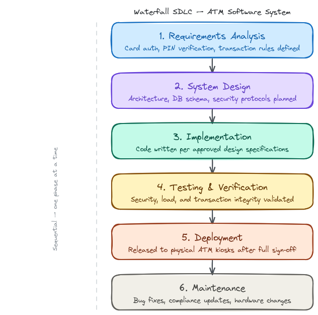

# Software Engineering Assignment: SDLC Model Selection

**Course:** Software Engineering  
**Topic:** SDLC Model Selection  
**Type:** Individual Assignment  

---

## 1️⃣ Introduction
### Project Selected: ATM Software System
An **ATM (Automated Teller Machine) Software System** is a mission-critical application designed to facilitate financial transactions such as cash withdrawals, balance inquiries, and fund transfers. This system requires a high degree of precision, robust security protocols, and seamless integration with the bank's core database. Given the nature of financial data, there is zero tolerance for errors or system instability.

---

## 2️⃣ Selected SDLC Model
The most appropriate model for an ATM Software System is the **Waterfall Model**.

---

## 3️⃣ Justification
The Waterfall Model is selected due to the following reasons:

* **Requirement Stability:** The core requirements of an ATM—card authentication, PIN verification, and transaction processing—are well-defined and unlikely to change during the development process.
* **High Reliability and Security:** In banking, security is paramount. The Waterfall model’s structured phases allow for rigorous verification and validation at each stage before moving to the next.
* **Disciplined Documentation:** This model emphasizes thorough documentation. For financial systems, having a clear audit trail of requirements, design specifications, and test cases is essential for regulatory compliance.
* **Low Risk of Requirement Creep:** Since the system interfaces with specific hardware and legacy banking databases, a linear approach ensures that all technical constraints are addressed upfront.
* **Clear Milestones:** The sequential nature provides the bank with clear progress indicators, ensuring that the software is fully mature and tested before being deployed to physical kiosks.

---

## 4️⃣ Comparison with Other Models
* **Agile Model:** Agile is less suitable because it encourages frequent changes and rapid iterations. In an ATM system, frequent updates to core transaction logic could introduce unpredictable security vulnerabilities or "bugs" that lead to significant financial loss.
* **Spiral Model:** While the Spiral model is good for risk management, it can be overly complex and expensive for a project where the requirements are already well-understood and the technology stack is standardized.

---

## 5️⃣ Diagram: Waterfall SDLC

---

## 6️⃣ Conclusion

For an ATM Software System, the Waterfall Model is the most logical choice. Its rigid structure, emphasis on documentation, and requirement for a completed phase before the next begins ensure the high-integrity environment required for financial software. It prioritizes system stability and security over development speed, which is the correct trade-off for banking infrastructure.
