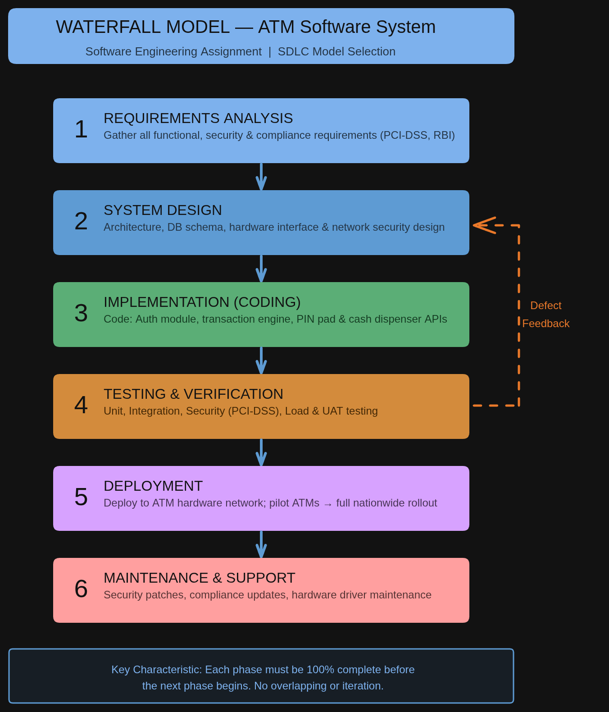

# SOFTWARE ENGINEERING ASSIGNMENT
## SDLC Model Selection for ATM Software System

| Course | Software Engineering |
| :--- | :--- |
| **Topic** | SDLC Model Selection |
| **Selected Project** | ATM Software System |
| **SDLC Model** | Waterfall Model |
| **Assignment Type** | Individual Assignment |

---

## 1. Introduction
An **ATM (Automated Teller Machine) Software System** is a critical financial application that enables bank customers to perform self-service banking transactions without the assistance of a human teller. These transactions include cash withdrawals, balance inquiries, fund transfers, PIN changes, and mini-statement generation. 

The ATM software interfaces directly with the bank's core banking infrastructure, card processing networks, and physical hardware components such as the cash dispenser, card reader, PIN pad, and receipt printer.

### Key Characteristics:
* **Security-Critical:** Handles highly sensitive financial transactions requiring absolute accuracy.
* **High Availability:** Operates 24/7 with strict uptime requirements (99.9%+ availability).
* **High Volume:** Processes hundreds to thousands of transactions per day.
* **Regulated Domain:** Interfaces with banking regulatory frameworks and compliance standards (PCI-DSS, RBI norms).
* **Fixed Requirements:** Requirements are defined precisely by banking standards before development begins.

---

## 2. Selected SDLC Model: Waterfall Model
The **Waterfall Model** is a linear-sequential software development approach in which each phase must be completed before the next phase begins, with no overlapping or iterative cycles. It is the most appropriate model for the ATM Software System.

### Sequential Phases:
| Phase | Name | Description |
| :--- | :--- | :--- |
| Phase 1 | Requirements Gathering & Analysis | All functional and non-functional requirements are collected from stakeholders and documented comprehensively. |
| Phase 2 | System Design | High-level and low-level designs are created — including database schema, hardware interfaces, and security protocols. |
| Phase 3 | Implementation (Coding) | Developers write code according to design documents. Each module is coded independently. |
| Phase 4 | Testing | Rigorous unit testing, integration testing, security testing, and User Acceptance Testing (UAT) are performed. |
| Phase 5 | Deployment | The system is deployed across ATM machines, followed by pilot testing at select locations. |
| Phase 6 | Maintenance | Post-deployment bug fixes, security patches, and minor enhancements are handled. |

---

## 3. Justification for Selecting Waterfall Model
The selection is strongly justified by the following points:

* **Well-Defined and Stable Requirements:** All requirements, including security protocols (PCI-DSS), are defined clearly by regulatory bodies before development begins. Since requirements are fixed, Waterfall's sequential approach is ideal.
* **Low Risk of Requirement Changes:** Core ATM functionality adheres to strict industry standards established by financial regulators (RBI, SWIFT). These standards evolve slowly through formal change-control processes.
* **High Security and Accuracy:** A single bug can lead to massive financial losses. Waterfall’s emphasis on complete verified design before coding and an exhaustive testing phase ensures zero-defect tolerance.
* **Extensive Documentation Required:** Audit trails and regulatory certifications (PCI-DSS) are legal requirements for financial software. Waterfall inherently produces thorough documentation at every stage.
* **Hardware-Software Integration Complexity:** Software must integrate with physical hardware on fixed timelines. Waterfall ensures hardware specifications are finalized upfront, preventing costly mismatches after deployment.

---

## 4. Comparison with Other Models
Other popular models are less suitable for the ATM Software System:

### 4.1 Agile Model — Why Not Suitable
| Criteria | Agile Model | Why Not for ATM |
| :--- | :--- | :--- |
| **Requirements** | Evolving, sprint-based | ATM requirements are fixed & regulatory |
| **Documentation** | Minimal | Compliance demands full documentation |
| **Testing** | Continuous, informal cycles | ATM needs exhaustive formal testing |
| **User Involvement** | Constant collaboration | End-users can't influence bank standards |

**Verdict:** Agile's iterative sprints are counterproductive where all requirements must be fully validated before hardware installation and regulatory certification.

### 4.2 Spiral Model — Why Not Suitable
* **Excessive Risk Iterations:** ATM systems have well-understood, low-novelty requirements; the extensive risk analysis cycles in Spiral are overkill.
* **Mismatched Context:** Spiral is suited for high-uncertainty projects (military/aerospace), whereas ATMs require high precision with known requirements.
* **Higher Cost:** Multiple prototyping phases make it significantly more expensive without proportional benefit for a well-specified system.

---

## 5. Diagram of the Waterfall Model
The diagram below illustrates the Waterfall Model as applied to the ATM Software System. Each phase flows sequentially downward, with feedback loops only for defect detection.

---

## 6. Conclusion
Based on a thorough analysis, the **Waterfall Model** emerges as the most suitable approach. Its structured and documentation-heavy nature ensures every transaction is backed by software that has been rigorously designed, thoroughly tested, and fully compliant with banking standards. While Agile and Spiral have their place in dynamic projects, the ATM system’s stability and hardware dependencies make Waterfall the definitive and most justified choice.